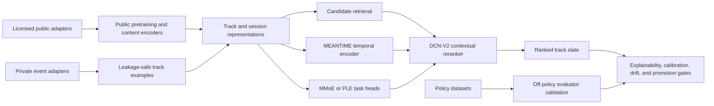

# Recommender Expansion Architecture

This expansion changes the project from a top-artist model comparison into a track-level recommendation research platform. The architecture keeps private listening data isolated, adds public and multimodal research lanes, and applies one evaluation and governance contract across every model family.

## Platform Lanes

### Private Personal Lane

The private lane is the product-facing source of truth.

- Build leakage-safe examples from track URI, timestamp, session, ordered history, time gaps, skips, dwell, repeats, and session endings.
- Add weak positive evidence from saved tracks, playlists, and search-to-play interactions.
- Do not interpret an absent save or playlist membership as a negative label.
- Keep raw personal exports and derived identifiers out of public artifacts.

### Public Music Lane

The public lane supports multi-user collaborative benchmarks and content representation learning.

- Candidate datasets include LFM-1b, Million Song Taste Profile, FMA, and Music4All-Onion.
- Every adapter must record dataset version, download source, license, item namespace, and permitted use.
- Public user and item identifiers remain separate from the private export.
- Transfer encoder behavior or content representations; do not assume public user or item embeddings map directly to the private catalog.
- Spotify Platform and Spotify API content must not be used as model-training data.

### Causal And Policy Lane

KuaiRand and Open Bandit data validate propensity-aware evaluation. They are not substitutes for music-personalization data.

- Require logged action, reward, and propensity.
- Report overlap, weight tails, and effective sample size with IPS, SNIPS, and doubly robust estimates.
- Do not tune a policy directly against the same evaluation log used to claim policy value.

## Recommendation Flow

The candidate generator owns recall. The reranker can only reorder retrieved items, so every report must preserve candidate-source and retrieval-recall evidence.

## Shared Data Contract

Dataset adapters should converge on a logical schema:

| Field | Requirement |
| --- | --- |
| `user_id` | Private pseudonym, public dataset user, or pseudo-user session |
| `session_id` | Leakage-safe session boundary |
| `item_id` | Dataset-local stable identifier |
| `timestamp` | Event time when available |
| `event_type` | Play, skip, save, search interaction, playlist add, or policy event |
| `dwell_ms` | Listening duration when available |
| `explicit_positive` | Save or playlist evidence with provenance |
| `context` | Device, time, session, friction, and candidate features |
| `propensity` | Optional; required for off-policy evaluation |
| `modalities` | Optional licensed audio, text, image, or frozen embeddings |

Vocabulary fitting, normalizers, negative sampling state, and feature transforms must use training data only. Temporal validation and test partitions must remain untouched by Optuna.

## Model Portfolio

The machine-readable source of truth is `spotify.expansion_registry`.

### Component-Ready

- Track-level example construction and two-stage retrieval contract
- DCN-V2 contextual reranker component
- MMoE and PLE multi-task component
- MEANTIME/TiSASRec-inspired temporal sequence component

Component-ready means the isolated implementation exists. It does not mean launcher integration, benchmark evidence, promotion gates, or production serving are complete.

### Integration And Planned

- S3-Rec or DuoRec-style self-supervised sequence pretraining
- EASE, implicit ALS, and BPR session or playlist baselines
- LightGCN and RecVAE public collaborative experiments
- Licensed multimodal cold-start content tower
- KuaiRand and Open Bandit policy-evaluation adapters

### Research-Only

- SS4Rec or Mamba4Rec after histories reach at least 256 events
- TIGER-style semantic identifiers after stable multimodal embeddings and strong retrieval baselines exist

These models should not displace simpler baselines solely because they are newer.

## Explainability Routing

`spotify.model_explainability` declares capabilities and provides dependency-free deterministic perturbation utilities.

| Family | Primary strategy | Required supporting evidence |
| --- | --- | --- |
| Trees | TreeSHAP-compatible | Native importance and deterministic permutation fallback |
| DCN-V2 | Gradient SHAP-compatible | Integrated gradients or deterministic feature ablation |
| Neural sequence | Integrated gradients | Position/context ablation and baseline declaration |
| Retrieval | Candidate recall | Embedding neighborhoods, leave-one-event-out tests, and coverage slices |
| Multi-task | Per-head attribution | Head loss weights, per-head calibration, and conflict report |

Attention values are diagnostics, not standalone explanations. Explanation artifacts must record model version, data fingerprint, split, seed, target score, baseline, and explainer configuration.

## Optuna Contract

Every supported registry entry declares an objective, direction, and bounded search-space metadata. Studies should follow these rules:

1. Optimize retrieval models on candidate recall before reranker quality.
2. Optimize rerankers on NDCG or MRR using a frozen candidate source.
3. Preserve task-head metrics while optimizing a constrained multi-task aggregate.
4. Keep self-supervised pretraining budget separate from fine-tuning budget.
5. Compare long-sequence models under compute-matched sequence lengths and batch budgets.
6. Persist the data fingerprint, search space, sampler seed, pruning policy, and completed-trial table.

## Promotion Requirements

A family is eligible for promotion only after:

- repeated temporal benchmark runs use the same data and candidate contract
- ranking quality, calibration, coverage, long-tail, and repeat-rate guardrails are present
- explanations pass basic stability and perturbation-faithfulness checks
- missing-label behavior is reported for multi-task models
- public or multimodal inputs have license and provenance records
- serving latency, peak memory, and artifact size fit the selected deployment profile
- champion-gate evidence distinguishes retrieval failures from reranking failures

The expansion registry tracks implementation readiness. Existing benchmark, safety, governance, and deployment modules remain responsible for experimental and production readiness.
